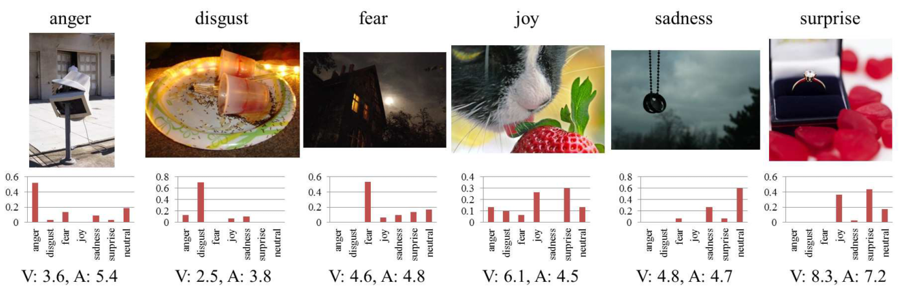

### Tools 

* [Netscope](http://ethereon.github.io/netscope/quickstart.html): A web-based tool for visualizing neural network architectures (or technically, any directed acyclic graph). It currently supports Caffe's prototxt format.

### Articles

##### _A mixed bag of emotions: Model, predict, and transfer emotion distributions_

_Peng, Kuan-Chuan, et al. "A mixed bag of emotions: Model, predict, and transfer emotion distributions." Proceedings of the IEEE Conference on Computer Vision and Pattern Recognition. 2015._

###### The Emotion6 image database

The Cornell Emotion6 image database ([download](http://chenlab.ece.cornell.edu/people/kuanchuan/publications/Emotion6.zip)) consists of 1980 images (330 images for each of the 6 Ekman's basic emotions). The ground-truth annotations for each image include scores for the evoked Valence/Arousal levels and the evoked emotion.

=========================================

[Back to README](../README.md)