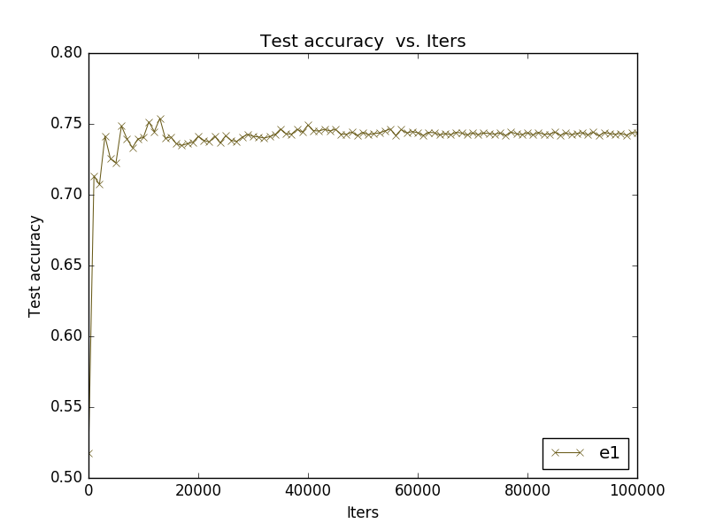

Classifying between positive and negative images, using the evoked *valence* in the Emotion6 dataset.  

## Tasks

- [x] Generate positive(+1)/negative(0) labels for the Emotion6 database using the valence score provided (see [setup]())
- [x] _Fine-tune_ the AlexNet model using the Emotion6 positive/negative labels.
- [x] _Fine-tune_ the Places CNN model using the Emotion6 positive/negative labels.
- [ ] Compose a mosaic image given the classification results with the different models (e.g. green border for images classified as positive, red for negative).
- [ ] Change the learning rate and decay of the _new_ layer in the places net, so that the weights of this layer during finetuning change faster than the pretrained layers.
- [ ] Represent the response of the hidden layers to the test images with the Places net before and after the finetuning, to compare responses.
- [ ] Repeat the fine tuning with a single output of the net. Instead of using a Softmax-based Loss function, try a Sigmoid-based loss-layer.
- [ ] Draw a representation of the learning curve (accuracy v. number of iterations).
- [ ] Train regression model using original valence annotations.
 
### e1. Fine-tuning the AlexNet model to classify images as _emotionally_ positive/negative:

After generating the positive/negative labels by thresholding the valence ground-truth scores, the AlexNet model weights are used as the starting point for training a 2 class classifier.

Finetuning existing nets is relatively easy with Caffe. We need the following files:

1. A solver prototxt file to tell Caffe how do we want to train the net (see the [Caffe docs](https://github.com/BVLC/caffe/wiki/Solver-Prototxt) for more info). We will name our solver `e1.solver.prototxt`. If you modify an existing solver, make sure that it points to the right `net` file (see below):
    ```
    net: "e1.train_val.prototxt"
    ```
2. A train prototxt file to define the structure of the net. We will use a modified version of the Model Zoo's AlexNet model (`$CAFFE_ROOT/models/bvlc_alexnet/train_val.prototxt`). We copy this model to `e1.train_val.prototxt` and make two changes:
    - The data layers (at the top of the file) are modified to use the Emotion6 image lists:
 
    ```
    layer {
      name: "data"
      type: "ImageData" <<< The data layer consists of image files
      top: "data"
      top: "label"
      include {
        phase: TRAIN
      }
      
      image_data_param {
        source: "em6_posneg_train.txt" <<< New source of images 
        batch_size: 50
        new_height: 256
        new_width: 256
      }
    }
    ```
    
    - The output layer (`fc8`) is modified: the number of outputs is changed to 2, corresponding to our positive/negative classes:
  
    ```
        layer {
          name: "fc8_emotion6" <<< Changing the name of the layer is important!
          type: "InnerProduct"
          bottom: "fc7"
          top: "fc8_emotion6"
          ...
          inner_product_param {
            num_output: 2 # <<< The number of outputs has changed
            ...
          }
        }
    ```

    Also, notice that the name of the layer has changed to `fc8_emotion6`. This is important as it will tell Caffe this is a new layer. 

    _This 2-output scheme may not be the best approach, as the two classes are clearly disjoint. We'll use a 1-output layer in upcoming tests (notice this will require a Sigmoid-based Loss instead of a Softmax-based loss)_ 
3. The pre-trained AlexNet model (`$CAFFE_ROOT/models/bvlc_alexnet/bvlc_alexnet.caffemodel`), which is a *binary* file containing weights for our net.

##### Fine tuning procedure

Once we have our files, we simply run the `caffe train` command, using our solver file and the option `-weights`, which tells Caffe to start training from the weights of AlexNet: 

    caffe train -solver e1.solver.prototxt -weights $CAFFE_ROOT/models/bvlc_alexnet/bvlc_alexnet.caffemodel -gpu 0 &>e1.log
    
The last part (`&>e1.log`) will redirect the training log messages to our log file.
 
_Finetuning magic: After running this command, Caffe will detect the correspondence of the layers in `e1.train_val.prototxt` file and the existing layers in the binary model (`bvlc_alexnet.caffemodel`). However, as the `fc8_emotion6` layer is not present in the original model, Caffe will add this layer to our new model and initialize its weights according to our net file._

    ...
    I0617 11:10:50.648298 30653 caffe.cpp:129] Finetuning from /<path>/bvlc_alexnet.caffemodel
    ... 
    I0617 11:11:07.893702 30653 net.cpp:752] Ignoring source layer fc8

    
##### Results

_We can use the script in `$CAFFE_ROOT/tools/extra/plot_training_log.py.example` to plot out learning curves into a png file._




### e2. Fine-tuning the placesCNN model to classify images as _emotionally_ positive/negative (same lr weights in all layers):

Similarly to the previous experiment, this one tries to _update_ a pretrained model to cope with the same 2-class classification problem. The structure of the solver and the required files is very similar, with the following considerations: 

- The places CNN model has been downloaded from [here](http://places.csail.mit.edu/model/placesCNN_upgraded.tar.gz) and the files have been saved in `$CAFFE_ROOT/extra_models/placesCNN_upgraded`.
- The net file (`e2.train_val.prototxt`) has been modified as in the previous example to use the Emotion6 images as input. Additionally, the prototxt has been updated to follow the current Caffe data format, by using the `$CAFFE_ROOT/build/tools/upgrade_net_proto_text` binary.
- **learning rate**: to analyze the effect of using different fine tuning strategies, the learning rate of the _new_ layer has been kept unaltered: 

```
layer {
  name: "fc8_emotion6"
  type: "InnerProduct"
  bottom: "fc7"
  top: "fc8_emotion6"
  param {
    lr_mult: 1 << same weights as other layers'
    decay_mult: 1
  }
  param {
    lr_mult: 2 << same weights as other layers'
    decay_mult: 0
  }
  inner_product_param {
    num_output: 2
    ...
  }
}

```


##### Results


